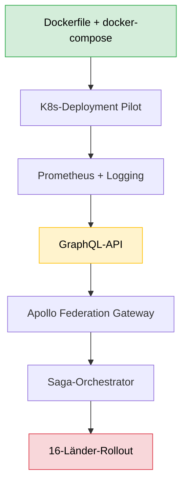

# VCC-URN Weiterentwicklungsstrategie

**Version:** 1.0  
**Datum:** November 2025  
**Status:** Strategisches Planungsdokument

---

## Executive Summary

Das VCC-URN-Projekt hat eine solide Grundlage für die föderale Verwaltungsdigitalisierung geschaffen. Diese Strategie definiert den Weg zur Produktionsreife und langfristigen Weiterentwicklung. Sie orientiert sich am strategischen Konzept aus `introducing.md` und adressiert die in `TODO.md` identifizierten Lücken.

**Kernerkenntnis:** Das aktuelle System ist zu ~90% feature-complete für die Kernfunktionalität. Die Weiterentwicklung fokussiert auf drei Säulen:
1. **Production Readiness** – Deployment, Observability, Stabilität
2. **Federation Maturity** – GraphQL, erweiterte Peer-Integration, transaktionale Konsistenz
3. **Ecosystem Integration** – Anbindung an VCC-Komponenten (Veritas, Covina, Clara)

---

## 1. Strategische Positionierung im VCC-Ökosystem

### 1.1 Rolle des VCC-URN im Gesamtkonzept

Das VCC-URN ist die **globale Adressierungsschicht** für alle Verwaltungsobjekte im föderierten VCC-Ökosystem. Es fungiert als:

- **Persistent Identifier Service** – Eindeutige, persistente URNs für Dokumente, Akten, Anlagen, Bescheide
- **Federation Enabler** – Ermöglicht länderübergreifende Referenzierung ohne Datenduplizierung
- **Registry Hub** – Zentrale Auflösung von URNs zu Manifesten (Metadaten + Location)

**Integration mit VCC-Komponenten:**

```
┌─────────────────────────────────────────────────────────────┐
│                    VCC-Ökosystem (föderal)                  │
├─────────────────────────────────────────────────────────────┤
│  ┌──────────────┐   ┌──────────────┐   ┌──────────────┐   │
│  │   Veritas    │   │   Covina     │   │    Clara     │   │
│  │  (Graph-DB)  │◄──┤ (Ingestion)  │───┤   (LLM/RAG)  │   │
│  └──────┬───────┘   └──────┬───────┘   └──────────────┘   │
│         │                  │                                │
│         └──────────────────┼────────────────────────────────┤
│                            ▼                                │
│         ┌──────────────────────────────────────┐           │
│         │         VCC-URN Resolver             │           │
│         │  • URN Generation & Validation       │           │
│         │  • Manifest Storage & Resolution     │           │
│         │  • Federation Routing                │           │
│         └──────────────────────────────────────┘           │
├─────────────────────────────────────────────────────────────┤
│              Föderations-Gateway (Phase 3)                  │
│         GraphQL Supergraph (16 Länder-Instanzen)            │
└─────────────────────────────────────────────────────────────┘
```

**Integrationspunkte:**

1. **Covina → VCC-URN**: Bei der Dokumenten-Ingestion wird eine URN generiert und als primärer Schlüssel verwendet
2. **Veritas → VCC-URN**: Graph-Knoten speichern URNs als `urn`-Property; Proxy-Knoten referenzieren externe Objekte via URN
3. **Clara → VCC-URN**: RAG-Anfragen können via URN auf externe Kontexte zugreifen (föderierte Wissensbasis)

### 1.2 Alignment mit "Deutsche Verwaltungscloud-Strategie"

Das VCC-URN ist als **souveräner Microservice** konzipiert und fügt sich nahtlos in die DVS ein:

- **Deployment**: Container-ready (Docker/Kubernetes) für DVS/Deutschland-Stack
- **Data Residency**: Föderale Architektur garantiert Datensouveränität (Daten verbleiben im jeweiligen Land)
- **Interoperability**: Standardisierte APIs (REST heute, GraphQL Phase 3) für Vendor-Neutralität

---

## 2. IST-Analyse: Stärken und Lücken

### 2.1 Implementierter Stand (✅)

**Kernfunktionalität (100%):**
- URN-Parse/Generate/Validate gemäß RFC 8141
- Manifest-Speicherung (SQLAlchemy ORM, PostgreSQL/SQLite)
- Basis-Föderation (HTTP Peer-Resolver, TTL-Cache)
- API v1 (5 Endpunkte: generate, validate, store, resolve, search)
- Admin-API (Katalog-Management zur Laufzeit)

**Authentifizierung (100%):**
- 3 Auth-Modi (none/apikey/oidc)
- API-Key mit Rollen-Syntax
- OIDC/JWT mit JWKS-Validierung
- Rollenbasierte Zugriffskontrolle (RBAC)

**Infrastruktur (80%):**
- Alembic-Migrationen
- Health/Readiness-Endpoints
- CORS-Support
- Pytest-Tests (15 Tests, 100% Pass-Rate)
- CI-Pipeline (GitHub Actions)

### 2.2 Identifizierte Lücken (aus TODO.md)

**Production Readiness (MEDIUM Priority):**
- ❌ Produktives Dockerfile fehlt
- ❌ docker-compose.yml unvollständig (nur Postgres, keine App)
- ❌ Prometheus-Metriken nicht implementiert
- ❌ Structured Logging nicht implementiert

**Federation Maturity (HIGH Priority für Phase 3):**
- ❌ GraphQL-API fehlt (nur REST vorhanden)
- ❌ Saga-Pattern für transaktionale Konsistenz nicht implementiert
- ❌ Föderations-Gateway fehlt (nur Peer-to-Peer)

**Testing & Documentation (MEDIUM Priority):**
- ⚠️ Test-Coverage für Föderation lückenhaft
- ⚠️ Keine OIDC/JWT-Integrationstests
- 📝 Kompatibilitäts-Shims nicht dokumentiert

### 2.3 SWOT-Analyse

| **Stärken**                          | **Schwächen**                     |
|--------------------------------------|-----------------------------------|
| Solide Architektur (Clean Code)      | Fehlende Deployment-Artefakte     |
| Vollständige Kern-Features           | Begrenzte Observability           |
| Föderale Datenhoheit gewährleistet   | Noch kein GraphQL-Support         |
| Konsistente Dokumentation            | Test-Coverage ausbaufähig         |

| **Chancen**                          | **Risiken**                       |
|--------------------------------------|-----------------------------------|
| Integration in DVS/Deutschland-Stack | Föderale Governance-Komplexität   |
| Skalierung auf 16 Bundesländer       | Heterogene IT-Landschaften        |
| GraphQL Federation als State-of-Art  | Langfristige Standardisierung     |
| KI/RAG-Kompatibilität (Clara/Veritas)| Datenschutz bei Föderation        |

---

## 3. Entwicklungsstrategie: Drei Phasen zur Produktionsreife

### Phase 1: Production Hardening (3-4 Monate)

**Ziel:** Produktionsreifes Deployment und Betrieb für einzelne Landesinstanzen

**Priorität:** HOCH (Blocker für Produktiveinsatz)

#### 3.1.1 Deployment & Containerization

**Artefakte zu erstellen:**

1. **Produktives Dockerfile**
   - Multi-Stage Build (Build + Runtime)
   - Non-root User für Security
   - Minimal-Image (Alpine-basiert, <100MB)
   - Health-Check Integration

```dockerfile
# Beispiel-Struktur
FROM python:3.11-slim AS builder
WORKDIR /app
COPY requirements.txt .
RUN pip install --no-cache-dir -r requirements.txt

FROM python:3.11-alpine
RUN adduser --disabled-password --gecos "" --uid 65534 nonroot
COPY --from=builder /usr/local/lib/python3.11/site-packages /usr/local/lib/python3.11/site-packages
COPY --chown=nonroot:nonroot . /app
USER nonroot
HEALTHCHECK CMD curl --fail http://localhost:8000/healthz || exit 1
CMD ["uvicorn", "app.main:app", "--host", "0.0.0.0", "--port", "8000"]
```

2. **Vollständige docker-compose.yml**
   - App-Service (URN Resolver)
   - Postgres-Service (bereits vorhanden)
   - Optionaler Redis für erweiterten Cache (Phase 2)

3. **Kubernetes-Manifeste** (optional, aber empfohlen)
   - Deployment (mit Probes)
   - Service (ClusterIP/LoadBalancer)
   - ConfigMap (für ENV-Variablen)
   - Secret (für API-Keys/OIDC-Credentials)
   - HPA (Horizontal Pod Autoscaler)

**Technologien:**
- Docker 24+
- Kubernetes 1.28+ (optional)
- Helm Charts (optional, für einfache Konfiguration)

#### 3.1.2 Observability & Monitoring

**Komponenten:**

1. **Prometheus-Metriken** (`prometheus-fastapi-instrumentator`)
   - HTTP-Request-Metriken (Rate, Latenz, Fehler)
   - DB-Connection-Pool-Metriken
   - Custom Business-Metriken:
     - `urn_generate_total` (Counter)
     - `urn_resolve_federation_hits` (Counter: lokal vs. remote)
     - `urn_resolve_latency_seconds` (Histogram)

2. **Structured Logging** (JSON-Format)
   - python-json-logger oder structlog
   - Log-Level-Konfiguration via ENV (`URN_LOG_LEVEL`)
   - Kontext-Anreicherung (request_id, user_id, urn)

```python
# Beispiel: Structured Logging
import structlog
logger = structlog.get_logger()
logger.info("urn_resolved", urn=urn_str, source="local", latency_ms=42)
```

3. **Tracing** (optional, Phase 2)
   - OpenTelemetry für Distributed Tracing
   - Jaeger/Tempo-Integration

**Monitoring-Stack (Empfehlung):**
- Prometheus (Metriken-Sammlung)
- Grafana (Dashboards)
- Loki (Log-Aggregation)
- AlertManager (Alerting)

#### 3.1.3 Resilienz & Stabilität

**Maßnahmen:**

1. **Circuit Breaker** für Föderations-Anfragen
   - Bibliothek: `pybreaker`
   - Verhindert Kaskadenausfälle bei nicht erreichbaren Peers

2. **Retry-Logik** mit Exponential Backoff
   - Bibliothek: `tenacity`
   - Für transiente Netzwerk-Fehler

3. **Rate Limiting** (API-Schutz)
   - `slowapi` (für FastAPI)
   - Verhindert Überlastung/DoS

4. **Graceful Shutdown**
   - Bereits vorhanden via FastAPI Lifespan
   - Erweitern um Connection-Draining (aktive Requests abwarten)

**Deliverables Phase 1:**
- ✅ Dockerfile + docker-compose.yml
- ✅ K8s-Manifeste (Beispiele in `deployment/k8s/`)
- ✅ Prometheus `/metrics` Endpoint
- ✅ Structured Logging (JSON)
- ✅ Circuit Breaker + Retry-Logic
- ✅ Rate Limiting
- ✅ Updated Dokumentation (Betrieb-Sektion)

**Erfolgskriterien:**
- Deployment in <5 Minuten (Docker Compose)
- Startup-Zeit <10 Sekunden
- Grafana-Dashboard für Kern-Metriken
- Alerts für kritische Fehler

---

### Phase 2: Federation Evolution (4-6 Monate)

**Ziel:** Erweiterung der Föderationsfähigkeiten für Multi-Land-Szenarien

**Priorität:** MITTEL (für Pilot mit 2-3 Bundesländern)

#### 3.2.1 GraphQL-API als Föderations-Interface

**Motivation:** REST ist für komplexe, verteilte Abfragen limitiert. GraphQL bietet:
- **Präzise Queries** – Client fragt nur benötigte Felder an (kein Over-/Underfetching)
- **Federation Native** – Apollo Federation ermöglicht nahtlose Integration von 16 Subgraphs
- **Type Safety** – Schema als Vertrag zwischen Ländern

**Implementierung:**

1. **GraphQL-Schema definieren** (`vcc_urn/api/graphql/schema.graphql`)

```graphql
type URN {
  urn: String!
  nid: String!
  state: String!
  domain: String!
  objType: String!
  localAktenzeichen: String!
  uuid: String!
  version: String
}

type Manifest {
  urn: String!
  manifestJson: JSON!
  createdAt: DateTime!
  updatedAt: DateTime!
}

type Query {
  resolveURN(urn: String!): Manifest
  searchByUUID(uuid: String!, limit: Int, offset: Int): [Manifest!]!
  validateURN(urn: String!): ValidationResult!
}

type Mutation {
  generateURN(input: GenerateInput!): URN!
  storeManifest(urn: String!, manifest: JSON!): Manifest!
}
```

2. **Strawberry oder Ariadne** als GraphQL-Framework (FastAPI-kompatibel)

3. **Apollo Federation Support** (für Phase 3 Gateway)
   - `@key` Directives für Entity-Resolution
   - Subgraph als Teil des Supergraphs

```graphql
type Manifest @key(fields: "urn") {
  urn: String!
  # ... weitere Felder
}
```

4. **Parallele API-Strategie**
   - REST v1 bleibt bestehen (Backward Compatibility)
   - GraphQL unter `/graphql` (neue Clients)
   - Langfristig: Deprecation von REST zugunsten GraphQL

**Technologien:**
- strawberry-graphql oder ariadne
- Apollo Federation (für Gateway)

#### 3.2.2 Erweiterte Peer-Integration

**Aktuell:** Einfacher HTTP-Fallback zu Peers via `/api/v1/resolve`

**Ziel:** Robuste, produktionsreife Peer-Kommunikation

**Features:**

1. **Service Discovery** (für dynamische Peer-Topologie)
   - Consul oder Eureka für Registry
   - Alternative: Kubernetes Service Discovery

2. **Mutual TLS (mTLS)** für Peer-Authentifizierung
   - Zertifikats-basierte Authentifizierung zwischen Landesinstanzen
   - Verhindert Man-in-the-Middle-Angriffe

3. **Erweiterte Cache-Strategie**
   - Redis als zentraler Cache (ersetzt In-Memory TTL-Cache)
   - Cache-Invalidation via Event-Bus (z.B. Redis Pub/Sub)
   - Cache-Warming für häufig angefragte URNs

4. **Batch-Auflösung** (Performance-Optimierung)
   - Bulk-Endpoint: `POST /api/v1/resolve/batch` (URN-Liste)
   - DataLoader-Pattern für GraphQL (N+1-Problem)

**Technologien:**
- Redis 7+ (Cache + Pub/Sub)
- Consul (optional, Service Discovery)
- certifi/cryptography (mTLS)

#### 3.2.3 Föderation-Governance-Tools

**Problem:** Ohne zentrale Governance-Tools ist die Verwaltung von 16 Peers chaotisch.

**Lösung: Admin-Dashboard** (Web-UI)

**Features:**
- Peer-Status-Monitoring (Erreichbarkeit, Latenz)
- Katalog-Synchronisation (Domänen/Objekttypen abstimmen)
- URN-Statistiken (Top-Domains, häufigste Auflösungen)
- Audit-Log für Admin-Operationen

**Technologie:**
- Frontend: React/Vue.js (SPA)
- Backend: FastAPI Admin-API erweitern
- Optional: Metabase für Dashboards (SQL-basiert)

**Deliverables Phase 2:**
- ✅ GraphQL-API mit Federation-Support
- ✅ Redis-basierter Cache
- ✅ mTLS für Peer-Kommunikation
- ✅ Batch-Resolution-Endpoint
- ✅ Admin-Dashboard (MVP)
- ✅ Service Discovery Integration (optional)

**Erfolgskriterien:**
- GraphQL-Query-Latenz <100ms (lokale Auflösung)
- Peer-Auflösung <300ms (95. Perzentil)
- Cache-Hit-Rate >70%
- Dashboard zeigt alle Peers in Echtzeit

---

### Phase 3: Föderiertes Ökosystem (6-12 Monate)

**Ziel:** Vollständige Integration der 16 Bundesländer mit zentralem Gateway

**Priorität:** NIEDRIG (langfristige Vision, nach erfolgreichem Pilot)

#### 3.3.1 Zentraler Föderations-Gateway

**Architektur: Apollo Router** (GraphQL Supergraph)

```
┌─────────────────────────────────────────────────────┐
│              Apollo Router (Gateway)                │
│  • Query Planning & Orchestration                   │
│  • Policy Enforcement (RBAC, Data Residency)        │
│  • Monitoring & Tracing                             │
└────────┬────────┬────────┬─────────────────┬────────┘
         │        │        │                 │
    ┌────▼───┐ ┌─▼────┐ ┌─▼────┐         ┌──▼─────┐
    │  NRW   │ │  BY  │ │  BW  │   ...   │  SH    │
    │ (Sub)  │ │ (Sub)│ │ (Sub)│         │ (Sub)  │
    └────────┘ └──────┘ └──────┘         └────────┘
         VCC-URN Instanzen (je Land)
```

**Gateway-Funktionen:**

1. **Query Orchestration**
   - Föderierte Queries (z.B. „Zeige alle Anlagen von Unternehmen X" → Query über 3 Länder)
   - Parallele Ausführung + Aggregation

2. **Policy Enforcement Point**
   - Zentrale RBAC-Regeln (via OPA - Open Policy Agent)
   - Data Residency Checks (darf User aus NRW auf BY-Daten zugreifen?)

3. **Distributed Tracing**
   - OpenTelemetry für Ende-zu-Ende-Sichtbarkeit
   - Jaeger/Tempo für Trace-Visualisierung

**Technologien:**
- Apollo Router (Gateway)
- Open Policy Agent (RBAC)
- OpenTelemetry (Tracing)

#### 3.3.2 Transaktionale Konsistenz: Saga-Orchestrator

**Use Case:** Länderübergreifende Geschäftsprozesse (z.B. Standortwechsel eines Unternehmens von NRW nach BY)

**Implementierung:**

1. **Saga-Definition** (BPMN/YAML)

```yaml
# Beispiel: Standortwechsel-Saga
saga: relocate_company_site
steps:
  - service: nrw-urn-resolver
    action: archive_manifest
    urn: urn:de:nrw:bimschg:anlage:4711-0815-K1:6e8bc430-9c3a-11d9-9669-0800200c9a66
    compensation: restore_manifest

  - service: by-urn-resolver
    action: create_manifest
    urn: urn:de:by:bimschg:anlage:4711-0815-K1:a7f2d581-3b1c-42e8-8f3d-1c9e0a7b4d2e
    compensation: delete_manifest

  - service: nrw-graph-db
    action: update_edge
    edge: (:Company)-[:OPERATES_AT]->(:ProxySite)
    compensation: revert_edge
```

2. **Orchestrator-Engine** (z.B. Temporal, Camunda)
   - Zustandsmaschine für Saga-Execution
   - Automatische Kompensation bei Fehler
   - Audit-Trail für Compliance

**Technologie:**
- Temporal.io (Cloud-native Orchestrator)
- Alternative: Camunda Platform 8

#### 3.3.3 Föderiertes IAM (Identity & Access Management)

**Komponenten:**

1. **SAML 2.0 Federation**
   - Trust zwischen Land-IdPs (z.B. Keycloak-Instanzen)
   - Single Sign-On über Ländergrenzen

2. **SCIM-Integration** (User Provisioning)
   - Automatische Synchronisation von Benutzer-Rollen
   - Beispiel: Nutzer aus NRW erhält temporäre BY-Rechte

3. **JWT mit föderalen Claims**
   - Custom Claim: `urn:vcc:authorized_states: ["nrw", "by"]`
   - Gateway prüft Berechtigung bei Länder-übergreifenden Queries

**Technologie:**
- Keycloak (Open Source IdP)
- SCIM 2.0 (Provisioning)
- OAuth 2.0 / OIDC (bereits vorhanden)

**Deliverables Phase 3:**
- ✅ Apollo Router als Föderations-Gateway
- ✅ Saga-Orchestrator (Temporal)
- ✅ Föderiertes IAM (SAML + SCIM)
- ✅ Open Policy Agent Integration
- ✅ End-to-End-Tracing
- ✅ 16 Bundesländer angebunden

**Erfolgskriterien:**
- Föderierte Query über 5+ Länder in <2 Sekunden
- Saga-Success-Rate >99%
- Zero-Trust-Security (mTLS + RBAC + OPA)
- Zentral auditierbar (alle Zugriffe geloggt)

---

## 4. Technologische Best Practices

### 4.1 Architekturmuster (State-of-the-Art)

**1. Twelve-Factor App** (bereits größtenteils implementiert)
- ✅ Konfiguration via ENV (Settings-Klasse)
- ✅ Stateless Services (Session in DB)
- ✅ Logs als Event-Streams (Stdout/Stderr)
- ✅ Dev/Prod Parity (Docker Compose)

**2. Clean Architecture** (bereits implementiert)
- ✅ Schichtenmodell (API → Service → Repository → DB)
- ✅ Dependency Injection (FastAPI Dependencies)
- ✅ Domain-Driven Design (URN als Value Object)

**3. API-First Design**
- GraphQL-Schema als Vertrag (Phase 2)
- OpenAPI 3.1 für REST (bereits vorhanden)
- Versionierung (v1, v2, ...)

### 4.2 Security Best Practices

**1. Zero-Trust-Architektur**
- Mutual TLS für Peer-Kommunikation
- Jede Anfrage authentifiziert + autorisiert (kein implizites Vertrauen)

**2. Secret Management**
- HashiCorp Vault oder Kubernetes Secrets
- Rotation von API-Keys/JWT-Secrets

**3. Data Protection**
- Verschlüsselung in Transit (TLS 1.3)
- Verschlüsselung at Rest (DB-Level Encryption)
- DSGVO-Compliance (Löschfristen, Audit-Logs)

**4. Vulnerability Management**
- Dependabot (GitHub) für Dependency-Scanning
- Trivy oder Snyk für Container-Scanning
- Regelmäßige Security-Audits

### 4.3 Testing-Strategie

**Test-Pyramide:**

```
        ┌──────────┐
        │   E2E    │  5%  (Föderations-Szenarien)
        ├──────────┤
        │Integration│ 25% (API + DB)
        ├──────────┤
        │   Unit   │ 70% (Service-Logik, URN-Parser)
        └──────────┘
```

**Ergänzungen:**

1. **Contract Testing** (Phase 2)
   - Pact für API-Verträge zwischen Peers
   - Verhindert Breaking Changes

2. **Performance Testing**
   - Locust oder K6 für Load-Tests
   - Ziel: 1000 RPS (Requests/Sekunde) bei <100ms Latenz

3. **Chaos Engineering** (Phase 3)
   - Chaos Monkey für Resilienz-Tests
   - Simuliere Peer-Ausfälle, Netzwerk-Partitionen

**Coverage-Ziele:**
- Phase 1: 80% (inklusive Föderation)
- Phase 2: 85% (inklusive GraphQL)
- Phase 3: 90% (inklusive Saga-Orchestrator)

### 4.4 Dokumentation als Code

**Living Documentation:**

1. **OpenAPI/GraphQL Schema** als Single Source of Truth
   - Auto-generierte API-Docs (Swagger/GraphiQL)

2. **Architecture Decision Records (ADRs)**
   - Template: `docs/adr/0001-graphql-adoption.md`
   - Jede wichtige Entscheidung dokumentiert (warum GraphQL? warum Temporal?)

3. **Runbooks** (für Betrieb)
   - `docs/runbooks/deployment.md`
   - `docs/runbooks/incident-response.md`

4. **Changelog** (Keep a Changelog-Format)
   - `CHANGELOG.md` mit Semantic Versioning

---

## 5. Governance & Organisatorisches

### 5.1 Föderales Governance-Modell

**Gremium: KI-Föderationsrat VCC** (analog IT-Planungsrat)

**Zusammensetzung:**
- 1 Vertreter je Bundesland (16)
- 1 Bund-Vertreter (Koordination)
- 2 Experten (extern, Beratung)

**Aufgaben:**

1. **Standardisierung**
   - URN-Schema-Erweiterungen (neue Domänen/Objekttypen)
   - GraphQL-Schema-Evolution
   - Ontologie-Pflege (Veritas Graph-DB)

2. **Interoperabilitätspflege**
   - API-Breaking-Changes koordinieren
   - Deprecation-Policy (Min. 12 Monate Übergangszeit)

3. **Datenschutz-Koordination**
   - DSGVO-konforme Löschkonzepte
   - Grenzüberschreitende Zugriffs-Policies

4. **Budget & Betrieb**
   - Shared Cost-Modell (Gateway-Betrieb)
   - SLA-Definitionen (99.9% Uptime)

**Entscheidungsprozess:**
- Mehrheitsentscheidung (9 von 16 Stimmen)
- Konsensempfehlung für kritische Änderungen

### 5.2 Open Source Strategie

**Lizenz:** MIT mit Government Clause (bereits vorhanden in `license.md`)

**Community-Engagement:**

1. **Public Repository** (GitHub)
   - Transparenz für föderale Partner
   - Community-Contributions (Issues, PRs)

2. **Contributor-Richtlinien**
   - `CONTRIBUTING.md` (Coding Standards, PR-Prozess)
   - Code of Conduct

3. **Releases & Roadmap**
   - Semantic Versioning (v1.0.0, v1.1.0, v2.0.0)
   - Public Roadmap (GitHub Projects)

**Vorteile:**
- Vendor-Neutralität
- Schnellere Innovation durch Community
- Vertrauensbildung (Transparenz)

### 5.3 Betriebsmodell

**Deployment-Strategie:** Hybrid (föderal + zentral)

1. **Dezentral: Landesinstanzen**
   - Jedes Bundesland betreibt eigene VCC-URN-Instanz
   - Souveränität über eigene Daten

2. **Zentral: Föderations-Gateway** (Phase 3)
   - Betrieb durch Bund oder Shared-Service-Center
   - Hochverfügbarkeit (Multi-AZ, Auto-Scaling)

**Support-Modell:**

- **Tier 1:** Lokale IT-Abteilung (Bundesland)
- **Tier 2:** Zentrales Competence Center (Bund)
- **Tier 3:** Entwickler-Team (für Bugs/Features)

**SLA-Beispiel:**
- Verfügbarkeit: 99.9% (monatlich)
- Response Time: <200ms (95. Perzentil)
- Support-Reaktion: <4 Stunden (kritische Incidents)

---

## 6. Risikomanagement & Mitigation

### 6.1 Technische Risiken

| Risiko                                      | Wahrscheinlichkeit | Impact | Mitigation                                      |
|---------------------------------------------|--------------------|---------|-------------------------------------------------|
| Peer-Ausfall führt zu Totalausfall          | Mittel             | Hoch    | Circuit Breaker, Graceful Degradation           |
| GraphQL N+1-Problem (Performance)            | Hoch               | Mittel  | DataLoader-Pattern, Caching                     |
| Schema-Inkonsistenz zwischen Ländern         | Mittel             | Hoch    | Schema-Registry, Contract Testing               |
| Skalierungsprobleme bei 16 Peers             | Niedrig            | Hoch    | Horizontal Scaling (K8s HPA), Redis-Cache       |
| Security-Vulnerability in Dependencies       | Hoch               | Hoch    | Dependabot, regelmäßige Audits, Patch-Policy    |

### 6.2 Organisatorische Risiken

| Risiko                                      | Wahrscheinlichkeit | Impact | Mitigation                                      |
|---------------------------------------------|--------------------|---------|-------------------------------------------------|
| Fehlende Abstimmung zwischen Ländern         | Hoch               | Hoch    | Governance-Gremium, regelmäßige Sync-Meetings   |
| Budget-Kürzungen                             | Mittel             | Mittel  | Phasenmodell (frühe Erfolgsnachweise)           |
| Vendor Lock-In (bei Cloud-Diensten)          | Niedrig            | Mittel  | Open Source First, Multi-Cloud-Fähigkeit        |
| DSGVO-Verstöße bei Föderation                | Niedrig            | Hoch    | Data Residency-Checks, Audit-Logs, Legal Review|

### 6.3 Maßnahmenplan

**Kontinuierliche Überwachung:**
- Quartalsweise Risiko-Reviews
- Post-Mortem nach Incidents
- Retrospektiven nach Phasen-Abschluss

**Eskalationspfad:**
- Technisches Risiko → Tech Lead → CTO
- Governance-Risiko → Gremium → IT-Planungsrat

---

## 7. Roadmap & Meilensteine

### 7.1 Phasen-Zeitplan

```
2025 Q4  │  Phase 1: Production Hardening            │ ████████░░░░░░░░
2026 Q1  │  Phase 1 (Fortsetzung)                     │ ░░░░░░░░████░░░░
─────────┼──────────────────────────────────────────────────────────────
2026 Q2  │  Phase 2: Federation Evolution (Start)     │ ░░░░░░░░░░██░░░░
2026 Q3  │  Phase 2 (Fortsetzung)                     │ ░░░░░░░░░░░░████
2026 Q4  │  Phase 2 (Abschluss) + Pilot (2-3 Länder) │ ░░░░░░░░░░░░░░██
─────────┼──────────────────────────────────────────────────────────────
2027 Q1  │  Phase 3: Föderiertes Ökosystem (Start)    │ ░░░░░░░░░░░░░░░░
2027 Q2-Q4│ Phase 3 (Rollout auf 16 Länder)           │ ████████████████
```

### 7.2 Kritische Pfad-Abhängigkeiten



**Legende:**
- **Grün (A):** Phase 1 - Foundation (Production Hardening)
- **Gelb (D):** Phase 2 - Evolution (Federation Maturity)
- **Rot (G):** Phase 3 - Ecosystem (16-Länder-Integration)

### 7.3 Quick Wins (< 3 Monate)

**Sofort umsetzbar:**

1. **Dockerfile** (1 Woche)
   - Template existiert in `docs/complete-guide.md`
   - Anpassung auf Alpine-Base

2. **docker-compose.yml Erweiterung** (1 Woche)
   - App-Service hinzufügen

3. **Prometheus-Integration** (2 Wochen)
   - `prometheus-fastapi-instrumentator` einbinden
   - `/metrics` Endpoint

4. **Structured Logging** (1 Woche)
   - python-json-logger
   - ENV: `URN_LOG_FORMAT=json`

5. **Test-Coverage erhöhen** (3 Wochen)
   - Föderation-Tests
   - OIDC-Integration-Tests
   - Ziel: 80%

**Nutzen:**
- Sofortige Verbesserung der Produktionsreife
- Vertrauen bei Stakeholdern
- Basis für Phase 2

---

## 8. Erfolgsmessung & KPIs

### 8.1 Technische KPIs

| Metrik                          | Baseline (heute) | Phase 1 | Phase 2 | Phase 3 |
|---------------------------------|------------------|---------|---------|---------|
| Test-Coverage                   | ~60%             | 80%     | 85%     | 90%     |
| API-Latenz (P95)                | N/A              | <100ms  | <100ms  | <200ms  |
| Deployment-Zeit                 | N/A              | <5 min  | <3 min  | <3 min  |
| Uptime                          | N/A              | 99%     | 99.5%   | 99.9%   |
| Peer-Resolution Cache-Hit-Rate  | 0%               | 50%     | 70%     | 80%     |

### 8.2 Business-KPIs

| Metrik                          | Baseline (heute) | Phase 1 | Phase 2 | Phase 3 |
|---------------------------------|------------------|---------|---------|---------|
| Angebundene Bundesländer        | 0                | 1       | 3       | 16      |
| URNs generiert (kumulativ)      | 0                | 10k     | 100k    | 1M+     |
| Föderierte Auflösungen/Monat    | 0                | 0       | 1k      | 50k     |
| Zeit für neues Bundesland (Onboarding) | N/A       | N/A     | 1 Woche | 2 Tage  |

### 8.3 Governance-KPIs

| Metrik                          | Phase 1 | Phase 2 | Phase 3 |
|---------------------------------|---------|---------|---------|
| Governance-Meetings             | 0       | 4/Jahr  | 6/Jahr  |
| ADRs erstellt                   | 0       | 5       | 15      |
| Open Issues (GitHub)            | N/A     | <20     | <50     |
| Community-Contributors (extern) | 0       | 2       | 10      |

---

## 9. Lessons Learned & Best Practices (aus anderen Projekten)

### 9.1 Erfolgsbeispiele föderierter Systeme

**1. DNS (Domain Name System)**
- **Prinzip:** Föderierte Hierarchie (Root → TLD → Authoritative)
- **Übertragbar:** URN-Resolver als "Authoritative Server" je Land
- **Best Practice:** Caching (TTL), Fallback-Mechanismen

**2. E-Mail (SMTP Federation)**
- **Prinzip:** Dezentrale Server, Standard-Protokoll
- **Übertragbar:** Offene Standards (GraphQL-Schema)
- **Best Practice:** Retry-Logic, Store-and-Forward

**3. Kreditkarten-Netzwerke (Visa/Mastercard)**
- **Prinzip:** Zentrale Clearing-Stelle (analog Gateway)
- **Übertragbar:** Apollo Router als Orchestrator
- **Best Practice:** Transaktionale Konsistenz (Saga)

### 9.2 Anti-Patterns vermeiden

**❌ Distributed Monolith:**
- **Problem:** Enge Kopplung zwischen Peers (gemeinsame DB, synchrone RPC)
- **Mitigation:** Lose Kopplung (async Events), API-Verträge

**❌ Premature Optimization:**
- **Problem:** GraphQL + Redis + Saga vor erstem Produktiveinsatz
- **Mitigation:** Phasenmodell, Validierung durch Pilot

**❌ Configuration Hell:**
- **Problem:** 50+ ENV-Variablen, komplexe Abhängigkeiten
- **Mitigation:** Sane Defaults, Configuration Validation (Pydantic)

**❌ Vendor Lock-In:**
- **Problem:** AWS-spezifische Services (Lambda, DynamoDB)
- **Mitigation:** Open Source First, Container-Deployment

---

## 10. Zusammenfassung & Handlungsempfehlungen

### 10.1 Strategisches Fazit

Das VCC-URN-Projekt ist **technisch solide** und hat eine **klare Vision**. Die Weiterentwicklung muss nun den Fokus auf **Production Readiness** und **föderale Skalierbarkeit** legen. Die vorgeschlagene 3-Phasen-Strategie balanciert **kurze Erfolge** (Phase 1: Quick Wins) mit **langfristiger Tragfähigkeit** (Phase 3: 16-Länder-Föderation).

**Kernempfehlungen:**

1. **Start mit Phase 1 (Production Hardening)**
   - Dockerfile + docker-compose.yml (Woche 1-2)
   - Prometheus + Structured Logging (Woche 3-4)
   - Erste Deployment-Tests (Woche 5-6)
   - → **Deliverable:** Produktionsreifes URN-Resolver-Image

2. **Pilot-Projekt für Phase 2** (nach 3-4 Monaten)
   - Auswahl 2-3 Bundesländer (z.B. NRW, BY, BW)
   - GraphQL-API entwickeln
   - Föderations-Tests mit echten Daten
   - → **Deliverable:** Föderierte Auflösung über 3 Länder

3. **Governance-Aufbau parallel zu Technik**
   - Gründung "KI-Föderationsrat VCC" (Q1 2026)
   - URN-Schema finalisieren (inkl. Erweiterungen)
   - API-Contract definieren (GraphQL-Schema)

4. **Community-Engagement früh starten**
   - Public Repository + Roadmap (heute)
   - Contributor-Guidelines (Phase 1)
   - Erste externe Contributors (Phase 2)

### 10.2 Priorisierte Actionable Items (Next 30 Days)

| # | Task                                      | Owner         | Deadline    | Deliverable                          |
|---|-------------------------------------------|---------------|-------------|--------------------------------------|
| 1 | Dockerfile erstellen (Alpine-basiert)     | DevOps        | Woche 1     | `Dockerfile`                         |
| 2 | docker-compose.yml erweitern (App-Service)| DevOps        | Woche 1     | `docker-compose.yml`                 |
| 3 | Prometheus-Integration                    | Backend       | Woche 2     | `/metrics` Endpoint                  |
| 4 | Structured Logging (JSON)                 | Backend       | Woche 2     | JSON-Logs in Stdout                  |
| 5 | K8s-Manifeste (Beispiele)                 | DevOps        | Woche 3     | `deployment/k8s/*.yaml`              |
| 6 | Föderation-Tests erweitern                | QA            | Woche 3-4   | Test-Coverage >75%                   |
| 7 | ADR: Graphql-Adoption                     | Architect     | Woche 4     | `docs/adr/0001-graphql.md`           |
| 8 | Governance-Gremium initiieren             | Project Lead  | Monat 2     | Kick-off-Meeting                     |

### 10.3 Erfolgskriterien für die Strategie

**Phase 1 erfolgreich, wenn:**
- ✅ Deployment in <5 Minuten (Docker Compose)
- ✅ Grafana-Dashboard zeigt Metriken
- ✅ Test-Coverage >80%
- ✅ Dokumentation aktualisiert (Betrieb-Sektion)

**Phase 2 erfolgreich, wenn:**
- ✅ GraphQL-API produktiv (3 Länder)
- ✅ Föderierte Auflösung <300ms (P95)
- ✅ Admin-Dashboard zeigt Peer-Status
- ✅ Contract-Tests zwischen Peers

**Phase 3 erfolgreich, wenn:**
- ✅ 16 Bundesländer angebunden
- ✅ Gateway-Orchestrator stabil (>99.9% Uptime)
- ✅ Saga-Pattern für kritische Prozesse
- ✅ Föderale Governance etabliert

---

## Anhänge

### A. Glossar

- **URN (Uniform Resource Name):** Persistenter, ortsunabhängiger Identifikator (RFC 8141)
- **Föderation:** Verteiltes System ohne zentrale Datenhaltung (Data Residency)
- **GraphQL Federation:** Apollo-Technik zur Komposition verteilter GraphQL-APIs
- **Saga Pattern:** Transaktionsmodell für verteilte Systeme (eventual consistency)
- **ADR (Architecture Decision Record):** Dokumentation wichtiger Architekturentscheidungen
- **SLA (Service Level Agreement):** Verbindliche Zusage zu Verfügbarkeit/Performance

### B. Referenzen

**Technische Standards:**
- RFC 8141: Uniform Resource Names (URNs)
- RFC 7519: JSON Web Token (JWT)
- SAML 2.0: Security Assertion Markup Language
- SCIM 2.0: System for Cross-Domain Identity Management

**Architektur-Patterns:**
- Twelve-Factor App: https://12factor.net
- Clean Architecture: Robert C. Martin (2017)
- Saga Pattern: https://microservices.io/patterns/data/saga.html
- Data Mesh: Zhamak Dehghani (2019)

**VCC-Dokumente:**
- `docs/introducing.md` – Strategische Vision
- `docs/TODO.md` – Gap-Analyse
- `docs/urn-spec.md` – URN-Spezifikation
- `docs/complete-guide.md` – Technische Referenz

### C. Kontakt & Support

**Projekt-Homepage:** https://github.com/makr-code/VCC-URN

**Support-Kanäle:**
- Issues: GitHub Issues
- Diskussionen: GitHub Discussions
- E-Mail: vcc-urn@example.gov.de (Platzhalter)

**Governance-Gremium:**
- KI-Föderationsrat VCC (zu gründen)
- Meeting-Rhythmus: Quartalsweise
- Entscheidungsprozess: Mehrheitsentscheidung

---

**Dokumenten-Historie:**

| Version | Datum       | Autor          | Änderungen                                  |
|---------|-------------|----------------|---------------------------------------------|
| 1.0     | 2025-11-23  | VCC Team       | Initiale Strategiedefinition                |

---

**Ende des Dokuments**
